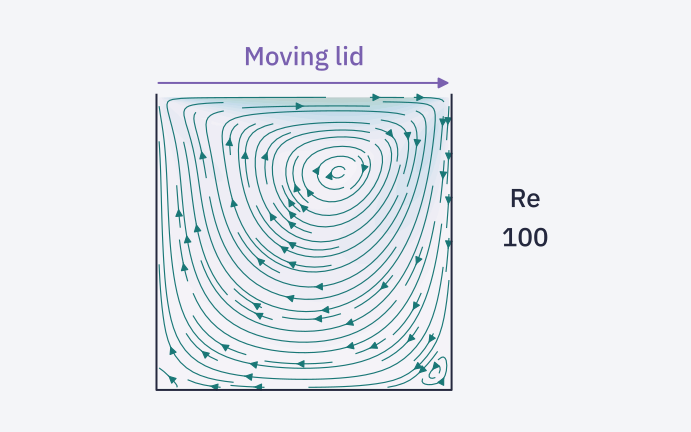

# Cavity flow



A compact Python solver for the two-dimensional lid-driven cavity problem. The existing staggered-grid projection method combines an explicit velocity update with a discrete-cosine-transform Poisson solve.

## Quick start

Python 3.10 or newer is recommended.

```bash
git clone https://github.com/EngFlavioMartins/cavity-flow.git
cd cavity-flow
python -m venv .venv
source .venv/bin/activate
python -m pip install -r requirements.txt
python run_example.py --output outputs/quickstart
```

On Windows, activate with `.venv\Scripts\activate`. The headless example writes velocity snapshots and a preview without opening a desktop window. Its short default run is a setup check, not a converged benchmark.

For the original interface, run `python MAIN.py` from the repository root. It needs Tkinter and a graphical desktop; some Linux installations provide Tkinter separately. If the platform does not support the legacy `.ico` window icon, use the headless example.

## Examples

```bash
python run_example.py --grid 32 --steps 501 --reynolds 100 --courant 0.02 --output outputs/re100
```

Snapshots are written every ten solver steps. The legacy driver pauses for one second at each write, so longer runs take correspondingly longer. This README's figure uses the same numerical kernels at Re = 100 on a 56 × 56 grid; it is a flow illustration, not an independent benchmark validation.

## Repository guide

| Location | Purpose |
| --- | --- |
| `run_example.py` | Headless entry point and plotting |
| `MAIN.py` | Original Tkinter interface |
| `solver_lidDrivenCavityFlow.py` | Time-stepping driver |
| `solverLibs/` | Grid, boundary conditions, projection and transforms |
| `uiLibs/` | Original interface assets and plotting |
| `docs/assets/header.svg` | Vector overview |

## Numerical scope

Use a square cavity and equal grid counts with this legacy implementation. Rectangular-grid support has not been validated. The explicit viscous update needs a sufficiently small time step as well as a suitable Courant number. Saved `t` values are step indices.

The original code and historical images remain available. The DCT approach credits [Michio Inoue's cavity solver](https://github.com/mathworks/2D-Lid-Driven-Cavity-Flow-Incompressible-Navier-Stokes-Solver).

## Contributing and attribution

See [CONTRIBUTING.md](CONTRIBUTING.md). Maintained by [Flavio Martins](https://engflaviomartins.github.io/).

No standalone software licence is included in this legacy repository; this update makes no licensing change.
